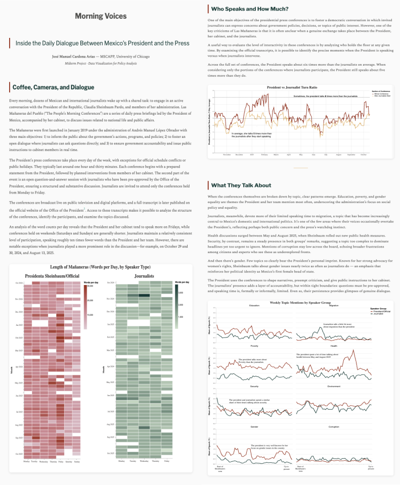

# Morning Voices: Inside the Daily Dialogue Between Mexico’s President and the Press

José Manuel Cardona Arias

## Description

Morning Voices is a data visualization project that explores the conversational dynamics between President Claudia Sheinbaum and Mexican journalists during the Mañaneras del Pueblo — the daily press conferences that define Mexico’s political communication landscape.

Using official transcripts scraped from the Presidencia de la República official site, this project visualizes who speaks more, how topics evolve over time, and how sentiment shifts throughout the conversation.
The work combines web scraping, natural language processing, and Altair data visualizations to reveal how the balance of voices, tone, and topics shape the national narrative.



## Data Sources

- Gobierno de México. (2024–2025). Presidential Press Conference Transcripts.
https://www.gob.mx/presidencia

- Barbieri, F. et al. (2022). pysentimiento: Multilingual Sentiment Models for Social Media.

- Geographic Data: Mexico High-Resolution GeoJSON.
angelnmara/geojson (GitHub).

## Repository Structure

```
morning_voices/
│
├── data/
│   ├── processed/               # Cleaned and structured datasets
│   ├── raw/                     # Raw scraped transcripts and metadata
│
│── milestones/                  # Temporary milestones for project
│
│── output/                      # Folder with fnal html file to render
│
├── scratch/                     # Experimental code / notebooks (not graded)
│
├── src/
│   ├── scrape.ipynb             # Functions to scrape conference transcripts
│   └── data_processing.py       # Cleaning, NLP preprocessing, topic analysis
│
├── static-viz/
│   ├── figures/                 # Exported static visualization SVGs
│   ├── static_final.ipynb       # Notebook with code for creating final visualizations
│   └── final_story.md           # Markdown narrative (main report)
│
├── final_story.md               # Markdown narrative (main report)
├── header.html                  # Optional HTML header customization
├── style.css                    # Custom stylesheet for HTML
├── requirements.txt
├── README.md
└── .gitignore
```

## How to use this repository

1. Create and activate the environment
```
uv venv
source .venv/bin/activate  # or "source .venv/bin/activate.fish" if using Fish shell
```
2. Install all dependencies
```
uv pip install -r requirements.txt
```
3. To view the narrative in your browser
```
open output/final_story.html
```
You can also just download the file in output/final_story.html and open it in any local browser.
