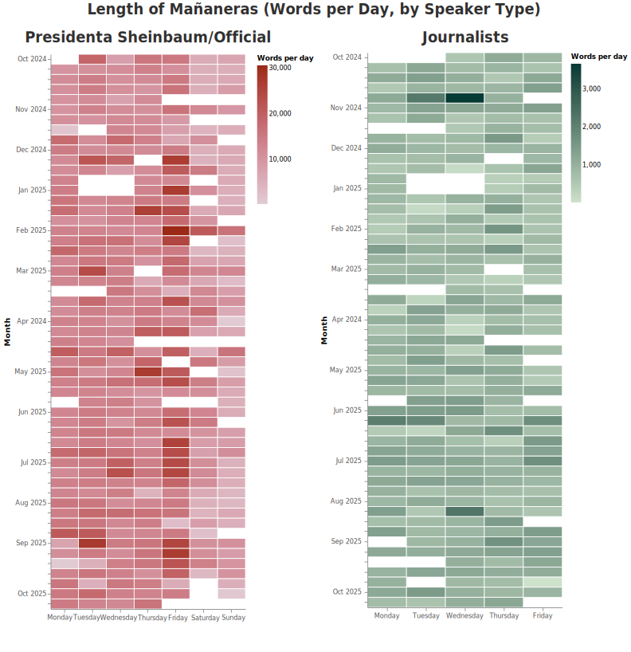
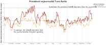
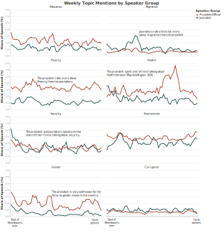
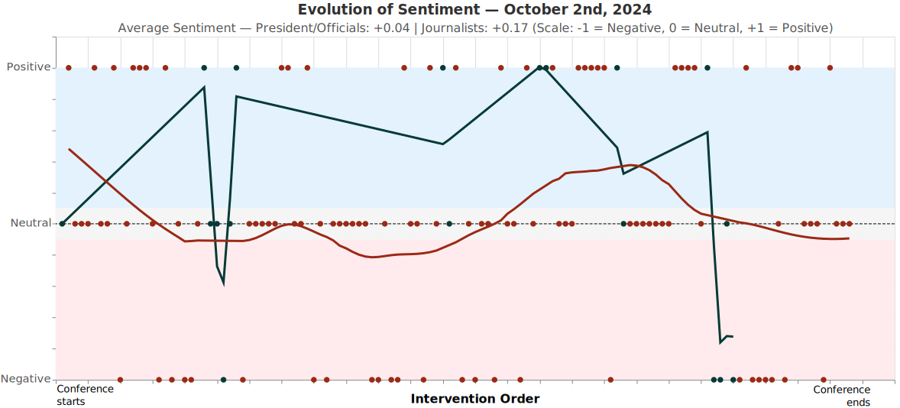
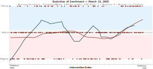
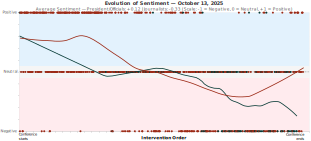

  <h1>Morning Voices</h1>
  <h2 style="font-weight:400; color:#063A35;">
    Inside the Daily Dialogue Between Mexico’s President and the Press
  </h2>
  

    <strong>José Manuel Cardona Arias</strong> — MSCAPP, University of Chicago 
    <em>Midterm Project · Data Visualization for Policy Analysis</em>
  

## Coffee, Cameras, and Dialogue

Every morning, dozens of Mexican and international journalists wake up with a shared task: to engage in an active conversation with the President of the Republic, Claudia Sheinbaum Pardo, and members of her administration. Las Mañaneras del Pueblo (“The People’s Morning Conferences”) are a series of daily press briefings led by the President of Mexico, accompanied by her cabinet, to discuss issues related to national life and public affairs.

The Mañaneras were first launched in January 2019 under the administration of Andrés Manuel López Obrador with three main objectives: 1) to inform the public about the government’s actions, programs, and policies; 2) to foster an open dialogue where journalists can ask questions directly; and 3) to ensure government accountability and issue public instructions to cabinet members in real time.

The President’s press conferences take place every day of the week, with exceptions for official schedule conflicts or public holidays. They typically last around one hour and thirty minutes. Each conference begins with a prepared statement from the President, followed by planned interventions from members of her cabinet. The second part of the event is an open question-and-answer session with journalists who have been pre-approved by the Office of the President, ensuring a structured and substantive discussion. Journalists are invited to attend only the conferences held from Monday to Friday.

The conferences are broadcast live on public television and digital platforms, and a full transcript is later published on the official website of the Office of the President[^1]. Access to these transcripts makes it possible to analyze the structure of the conferences, identify the participants, and examine the topics discussed.

An analysis of the word counts per day reveals that the President and her cabinet tend to speak more on Fridays, while conferences held on weekends (Saturdays and Sundays) are generally shorter. Journalists maintain a relatively consistent level of participation, speaking roughly ten times fewer words than the President and her team. However, there are notable exceptions when journalists played a more prominent role in the discussion—for example, on October 29 and 30, 2024, and August 13, 2025.

{ width=100% }

## Who Speaks and How Much?

One of the main objectives of the presidential press conferences is to foster a democratic conversation in which invited journalists can express concerns about government policies, decisions, or topics of public interest. However, one of the key criticisms of Las Mañaneras is that it is often unclear when a genuine exchange takes place between the President, her cabinet, and the journalists.

A useful way to evaluate the level of interactivity in these conferences is by analyzing who holds the floor at any given time. By examining the official transcripts, it is possible to identify the precise moments when the President is speaking versus when journalists intervene.

Across the full set of conferences, the President speaks about six times more than the journalists on average. When considering only the portions of the conferences where journalists participate, the President still speaks about five times more than they do.

{ width=1000px }

---

## What They Talk About

When the conferences themselves are broken down by topic, clear patterns emerge. Education, poverty, and gender equality are themes the President and her team mention most often, underscoring the administration’s focus on social policy and equality[^2].

Journalists, meanwhile, devote more of their limited speaking time to migration, a topic that has become increasingly central to Mexico’s domestic and international politics. It’s one of the few areas where their voices occasionally overtake the President’s, reflecting perhaps both public concern and the press’s watchdog instinct.

Health discussions surged between May and August 2025, when Sheinbaum rolled out new public health measures. Security, by contrast, remains a steady presence in both groups’ remarks, suggesting a topic too complex to dominate headlines yet too urgent to ignore. Mentions of corruption stay low across the board, echoing broader frustrations among citizens and experts who see these as underexplored fronts.

And then there’s gender. Few topics so clearly bear the President’s personal imprint. Known for her strong advocacy for women’s rights, Sheinbaum talks about gender issues nearly twice as often as journalists do — an emphasis that reinforces her political identity as Mexico’s first female head of state.

The President uses the conferences to shape narratives, preempt criticism, and give public instructions to her cabinet. The journalists’ presence adds a layer of accountability, but within tight boundaries: questions must be pre-approved, and speaking time is, formally or informally, limited. Even so, their persistence provides glimpses of genuine dialogue.

{ width=1000px }

---

## Where the Conversation Points

Not all states of Mexico get equal time in the President's daily conferences. Out of the times she explicitly mentions a state of Mexico in her speech, President Claudia Sheinbaum remarks most frequently Mexico City, followed by Guerrero, Veracruz, Oaxaca, and Sonora. Highlighting both the capital and some of the country's most socially vulnerable states. These references reflect a government narrative grounded in federal administration and social policy, focusing on regions where inequality and reconstruction remain central political themes.

Journalists, by contrast, turn their attention north and toward the border. Their top mentions include Sonora, Mexico City, Veracruz, Chiapas, and Baja California, underscoring recent issues tied to migration, climatological events and the lack of promt response from the government to such issues. The divergence between the two maps offers a possibly quiet but telling signal: while the President's words often project a policy agenda, the journalists' questions trace the country's tension topics and the places where Mexico's challenges feel most immediate and unresolved.

{ width=1000px }

---

## Tracing the emotional pulse of the conferences

What began as a space for transparency and democratization of information with the conferences has evolved into a barometer of Mexico's political climate. Beyond policy and politics, what emotions shape the dialogue between the President and the press? By examining sentiment, or the emotional tone of speech, each intervention in the conferences was categorized as positive, neutral, or negative[^3]. The result is a series of visualizations that make Mexico’s political dialogue visible as a living emotional landscape.

Each chart begins after the first journalist’s question, focusing on the moments when actual conversation begins. Every dot represents a single spoken intervention: red for the President and her officials, green for journalists. The lines represent rolling averages that smooth the conversation’s trajectory over time.

The vertical scale runs from Negative to Positive, with blue areas indicating positive sentiment, gray for neutral, and pink for negative tones. When the two lines move together, it signals agreement or composure. When they diverge, one rising and the other falling, tension enters the room. These graphs make abstract dynamics tangible: the optimism of early cooperation, the defensiveness that emerges under criticism, and the fatigue that follows recurring debates.

### October 2, 2024 - A warm beginning

The first Mañanera in which journalists participated marked a turning point for Sheinbaum’s administration. The visualization of that day shows a conversation that stayed mostly in the blue and gray zones. Journalists’ remarks, shown in green, oscillate gently around positive sentiment, reflecting curiosity and goodwill. The President’s tone, steady and measured, stays near neutral.

{ width=1000px }

### March 13, 2025 - When dialogue breaks down

Five months later, the Mañanera of March 13, 2025 became one of the most contentious of the year. The discussion centered on rising insecurity in Jalisco, more especifically the Teuchitlan case, a topic that quickly shifted the mood from measured to confrontational.

The journalists started the conversation by reasserting the level of disconfort from the population regarding the lack of response to the Teuchitlan case from the government. The President’s tone, initially calm, grew defensive, dipping below zero as she confronted criticism and reasserted authority.

{ width=1000px }

### August 13, 2025 - Where confrontation happens

One of the most recent conferences analyzed followed days of concern after sever flooding episodes in Veracruz. As the discussion opened, both the President and journalists tone started gravitating towards negative sentiment, showing a huge moment of tension where the President remaioned positive in her answers to a predominantly negative set of questions and comments from the journalists.

As questions intensified over the government’s slow response, the graph shows a clear descent. The President’s sentiment slips steadily from mild positivity to open defensiveness. Journalists’ tone, meanwhile, collapses into sharp negativity, reflecting anger and fatigue.

Towards the end, the Prtesident's tone recovered slightly but the journalists remained in the negativity side. The exchange ends where it began: divided, with the emotional distance between power and press wider than when it started.

{ width=1000px }

---

## Reading between the lines

More than a press conference, the Mañaneras del Pueblo has become a ritual where politics, communication, and emotion converge. Every exchange between the President and the press is both performance and negotiation, and most of all, a place for reflection.

The data reveal a structure that oscillates between dialogue and monologue. The President speaks most, framing the nation’s agenda and tone. Journalists intervene less, but their questions expose the limits of power’s patience. Each sentiment curve, each imbalance of words, traces not only who dominates the microphone, but how authority and accountability interact in real time.

The Mañaneras remind us that democracy is not measured by perfect balance, but by the persistence of questioning. Morning after morning, the President and the journalists rehearse the same dance, a dialogue that tests Mexico's public life.

---

[^1]: Presidencia de la República (Mexico). Presidencia de la República. Gobierno de México. Accessed November 03, 2025. https://www.gob.mx/presidencia
[^2]: Topic keywords were manually curated from frequent terms in the transcripts, government vocabulary, and major media outlets, including synonyms and institutional names to ensure broad semantic coverage.
[^3]: Sentiment was classified using the pysentimiento library’s Spanish RoBERTa model, which assigns each intervention a positive*, neutral, or negative label based on contextual tone and polarity. Pérez, J. M., Rajngewerc, M., Giudici, J. C., Furman, D. A., Luque, F., Alonso Alemany, L., & Martínez, M. V. (2023). pysentimiento: A Python Toolkit for Opinion Mining and Social NLP Tasks. arXiv preprint arXiv:2106.09462.
